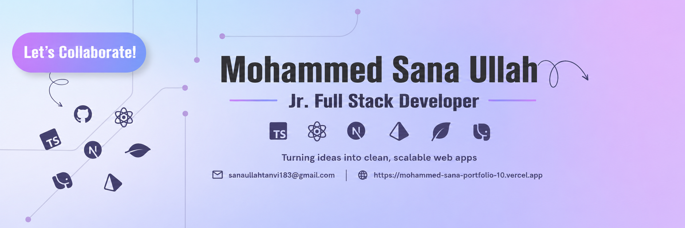

<!--- banner --->

  

 

<!--- title --->

  <ul align="center">
    
<h1 style="display: inline-block">Hi 👋, I'm Mohammed Sana Ullah</h1>

    <!--- typo --->
    
  </ul>

 

<!--- about --->
- 👋 Hi, I’m **[@Tanvi183](https://github.com/Tanvi183)**
- 🖥️ I’m currently working on **React.js, Next.js, Typescript and tailwind css** for frontend development.
- 🗄️ Using **Node.js, Express.js, MongoDB, Mongoose, PostgreSQL, and Prisma** for the backend.
- 🛠️ I’m currently learning **php, Laravel, Docker and AWS**.
- 💬 Ask me about **Full-Stack (React, Next, Node, Express, MongoDB, PostgreSQL)**.
- 🌐 Explore My Portfolio **[Tanvi183](https://mohammed-sana-portfolio-10.vercel.app/)** and My **[Resume](#)**
- 🎯 My current goal is improving **UI/UX and frontend performance**, and learning best practices for scalable Full-Stack Website development.
- 📫 Feel free to reach me out **[Email](mailto:sanaullahtanvi183@gmail.com)**
  
 

<!--- socials --->
## <b> FOLLOW ME ON SOCIALS:</b>

  

    
    
    
    
  

 

<!--- tech-stack --->
## 💻 <b>TECHNOLOGY STACK:</b>

### Languages:

  

### CSS Frameworks & Libraries:

  &nbsp;&nbsp;

### Frameworks & Libraries:

  &nbsp;&nbsp;

### Database & Model:

  &nbsp;&nbsp;

### Deployment Platform:

  

### Design & Graphics:

  

### Tools & Technologies:

  &nbsp;&nbsp;

 

<!--- stats --->
## 📊 <b>GITHUB STATS:</b>

  
  

 

## 🔥 <b>GITHUB STREAK & CONTRIBUTIONS:</b>

  
    
  

 

  ⭐ <b>Feel free to explore my repositories and connect with me!</b>

